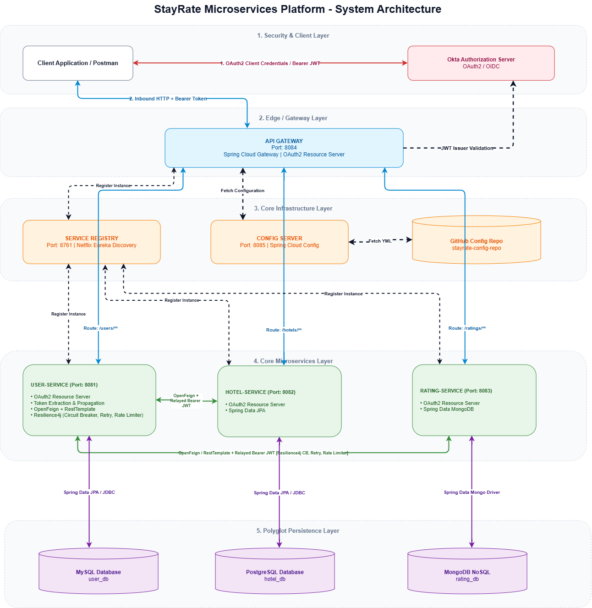

# 🏨 StayRate | Distributed Cloud-Native Microservices Platform

[](https://spring.io/projects/spring-boot)
[](https://spring.io/projects/spring-cloud)
[](https://developer.okta.com/)
[](https://www.oracle.com/java/)

**StayRate** is an enterprise-grade, cloud-native hotel rating and user management microservices ecosystem built with Java, Spring Boot, Spring Cloud, and Okta. It demonstrates real-world distributed systems best practices, including polyglot persistence, dynamic service discovery, centralized externalized configuration, fault tolerance, and secure JWT token propagation across boundaries.

---

## 🏛️ System Architecture

The ecosystem is structured into 5 decoupled infrastructure and domain layers:

1. **Security & Client Layer:** OAuth2 / OIDC authentication powered by Okta Authorization Server.
2. **Edge / Gateway Layer:** Spring Cloud Gateway acting as an OAuth2 Resource Server for centralized routing and access control.
3. **Core Infrastructure Layer:** Netflix Eureka Service Registry and Spring Cloud Config Server backed by a dedicated GitHub configuration repository.
4. **Core Microservices Layer:** Independent business services using OpenFeign and RestTemplate integrated with Resilience4j circuit breakers, retries, and rate limiters.
5. **Polyglot Persistence Layer:** Tailored database engines for individual services (MySQL, PostgreSQL, MongoDB).

### Architecture Flow Diagram



---

## 📂 Repository & Project Structure

```text
STAYRATE-PLATFORM/
├── assets/                               # Architecture diagrams, Draw.io XMLs, & Postman collections
├── stayrate-config-repo/                 # Externalized Spring Cloud YML configuration files
│
├── ApiGateway/                           # Port: 8084 | Spring Cloud Gateway
│   └── src/main/java/com/stayrate/gateway/
│       ├── config/                       # SecurityConfig (OAuth2 Resource Server)
│       ├── controller/                   # AuthController (/auth/login token exchange)
│       └── model/                        # AuthResponse DTO
│
├── ConfigServer/                         # Port: 8085 | Spring Cloud Config Server
│   └── src/main/java/com/stayrate/config/
│
├── ServiceRegistry/                      # Port: 8761 | Netflix Eureka Discovery Server
│   └── src/main/java/com/stayrate/registry/
│
├── UserService/                          # Port: 8081 | Core User Microservice[cite: 6]
│   └── src/main/java/com/stayrate/user/
│       ├── config/                       # MyConfig, WebSecurityConfig
│       │   └── interceptor/              # FeignClientInterceptor, RestTemplateInterceptor (JWT Relay)
│       ├── controller/                   # UserController (CRUD + RateLimiter)[cite: 6]
│       ├── dto/                          # ApiResponse, Hotel, Rating DTOs
│       ├── entity/                       # User entity (JPA)[cite: 6]
│       ├── exception/                    # GlobalExceptionHandler, ResourceNotFoundException
│       ├── external/client/              # HotelService & RatingService OpenFeign Clients
│       ├── repository/                   # UserRepository (Spring Data JPA -> MySQL user_db)[cite: 6]
│       └── service/                      # UserService interface
│           └── impl/                     # UserServiceImpl (Resilience4j CB, Retry, Rate Limiter)
│
├── HotelService/                         # Port: 8082 | Core Hotel Microservice
│   └── src/main/java/com/stayrate/hotel/
│       ├── config/                       # SecurityConfig
│       ├── controller/                   # HotelController, StaffController
│       ├── dto/                          # ApiResponse, HotelDto
│       ├── entity/                       # Hotel entity (JPA)
│       ├── exception/                    # GlobalExceptionHandler, ResourceNotFoundException
│       ├── repository/                   # HotelRepository (Spring Data JPA -> PostgreSQL hotel_db)
│       └── service/                      # HotelService interface
│           └── impl/                     # HotelServiceImpl
│
└── RatingService/                        # Port: 8083 | Core Rating Microservice
    └── src/main/java/com/stayrate/rating/
        ├── config/                       # SecurityConfig
        ├── controller/                   # RatingController (@PreAuthorize RBAC rules)
        ├── dto/                          # ApiResponse, RatingDto
        ├── entity/                       # Rating document (MongoDB)
        ├── exception/                    # GlobalExceptionHandler, ResourceNotFoundException
        ├── repository/                   # RatingRepository (Spring Data MongoDB -> rating_db)
        └── service/                      # RatingService interface
            └── impl/                     # RatingServiceImpl

```

---

## 🧰 Services & Port Mapping

| Service Name         |  Port  |    Database / Source    | Primary Responsibilities                                                                         |
| :------------------- | :----: | :---------------------: | :----------------------------------------------------------------------------------------------- |
| **Service Registry** | `8761` |           N/A           | Central dynamic service registration and discovery (Netflix Eureka).                             |
| **Config Server**    | `8085` |       GitHub Repo       | Externalized microservice configuration management.                                              |
| **API Gateway**      | `8084` |           N/A           | Edge server routing, load balancing, and OAuth2/JWT edge security verification.                  |
| **User Service**     | `8081` |    MySQL (`user_db`)    | Manages user profiles; aggregates hotel & rating information via OpenFeign with JWT propagation. |
| **Hotel Service**    | `8082` | PostgreSQL (`hotel_db`) | Manages hotel inventory records and staff details via Spring Data JPA.                           |
| **Rating Service**   | `8083` |  MongoDB (`rating_db`)  | High-throughput document store handling user reviews and ratings.                                |

---

## 🔍 Service Verification Matrix

| Endpoint Group      |            Methods             | Managed In Codebase By                       | Gateway Routing & Security Behavior                                                                                 |
| :------------------ | :----------------------------: | :------------------------------------------- | :------------------------------------------------------------------------------------------------------------------ |
| **`/auth/login`**   |             `GET`              | `AuthController.java`<br>`(ApiGateway)`      | Directly evaluates `@RegisteredOAuth2AuthorizedClient` & `@AuthenticationPrincipal` to return tokens & authorities. |
| **`/users/**`\*\*   | `GET`, `POST`, `PUT`, `DELETE` | `UserController.java`<br>`(UserService)`     | Proxied via API Gateway; handles user CRUD and distributed aggregate fetching.                                      |
| **`/hotels/**`\*\*  | `GET`, `POST`, `PUT`, `DELETE` | `HotelController.java`<br>`(HotelService)`   | Proxied via API Gateway; protected by RBAC (`@PreAuthorize("hasAuthority('Admin')")`).                              |
| **`/staffs`**       |             `GET`              | `StaffController.java`<br>`(HotelService)`   | Exposes internal hotel staff lists.                                                                                 |
| **`/ratings/**`\*\* | `GET`, `POST`, `PUT`, `DELETE` | `RatingController.java`<br>`(RatingService)` | Proxied via API Gateway; handles MongoDB-backed review documents with scope verification.                           |

---

## ✨ Key Technical Highlights

- **🔒 Distributed Security & Token Relay:** Inbound requests pass through Spring Cloud Gateway authenticated via Okta. Inter-service `Feign` clients and `RestTemplate` instances inject custom interceptors (`FeignClientInterceptor` / `RestTemplateInterceptor`) to propagate the Bearer JWT across service boundaries.
- **🛡️ Fault Tolerance & Resilience:** Integrated **Resilience4j** suite in `User-Service` providing Circuit Breakers, Automatic Retries, and Rate Limiters to eliminate cascading failures when downstream services experience downtime.
- **⚡ Dynamic Discovery & Config:** Service instances register dynamically with Eureka, pulling environment properties asynchronously from the centralized configuration server.
- **💾 Polyglot Persistence Architecture:** Employs relational engines (MySQL, PostgreSQL) alongside a NoSQL document database (MongoDB) mapped to distinct domain boundaries.

---

## 🚀 Local Startup Sequence

To spin up the platform locally, start the components in this exact order:

1. **Databases:** Ensure MySQL (`3306`), PostgreSQL (`5432`), and MongoDB (`27017`) instances are online and active.
2. **Config Server** (`Port: 8085`)
3. **Service Registry** (`Port: 8761`)
4. **API Gateway** (`Port: 8084`)
5. **Core Microservices:**
   - User Service (`Port: 8081`)
   - Hotel Service (`Port: 8082`)
   - Rating Service (`Port: 8083`)

---

## 🧪 Testing & Postman Collections

Pre-configured Postman collections for individual services and the master platform suite are available under the `/assets` folder in this repository:

- `ApiGateway_Postman_Collection.json`
- `UserService_Postman_Collection.json`
- `HotelService_Postman_Collection.json`
- `RatingService_Postman_Collection.json`
- `StayRate_Master_Platform_Postman_Collection.json`

```bash
# Example: Fetching aggregated user details via API Gateway

GET http://localhost:8084/users/usr-101
Authorization: Bearer <YOUR_OKTA_JWT_TOKEN>
```

---
